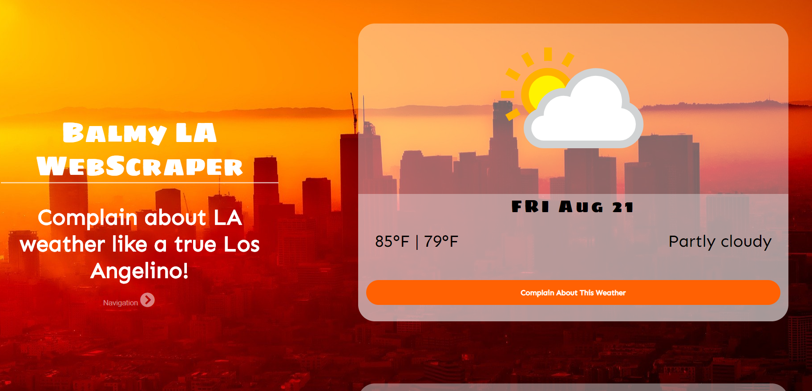
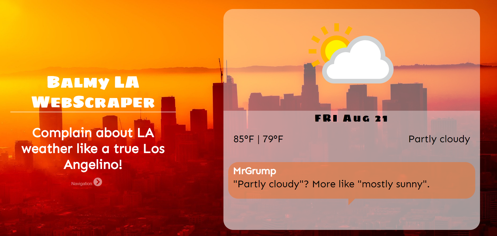

# Balmy LA Webscraper

**Link to Live:** https://balmy-la-webscraper.herokuapp.com/

**Example Username:** MrGrump
**Example Password:** 84ndaD3

This webpage scrapes information about LA's weather from Weather-And-Climate just so you can complain about it like a true Los Angelino!

In order to add a complaint, you'll need to log into a user. Add your own or use the example provided. We don't collect personal information (e-mail, address, etc).

## Motivation

Qurantine summer in LA: All of LA's terrible weather and no one to complain about it with! Hence this project.

## Build Status

Minimum Viable Product.

## Database used

- Heroku's MLab (MongoDbB/Mongoose)

## Languages/Technologies/Frameworks Used

- HTML
- Sass
- Javascript (Vanilla)
- Handlebars
- Mongo/Mongoose
- Express-Node-Session

## Screenshots

